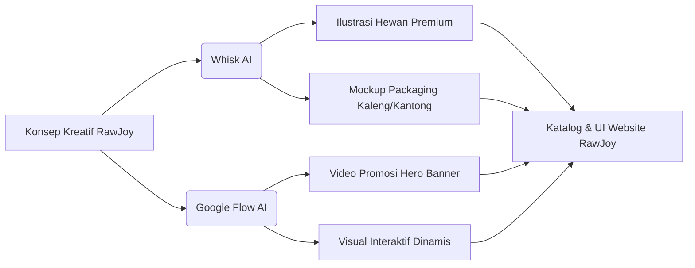

# LAPORAN TEKNIS PENGEMBANGAN WEBSITE RAWJOY
### Pembuatan Website Custom (From Scratch), Produksi Media Gen-AI (Whisk & Google Flow), dan Implementasi WebView Android
**Oleh: Web Developer / Pengembang Sistem**

---

## BAB I: PENDAHULUAN & ARSITEKTUR SISTEM

### 1.1 Deskripsi Proyek
Laporan teknis ini mendokumentasikan seluruh proses perancangan, penulisan kode, dan implementasi yang dilakukan oleh **Web Developer** dalam membangun website **RawJoy** dari nol (*from scratch*). RawJoy adalah sebuah platform e-commerce kelas premium yang menyediakan makanan alami terkurasi untuk kucing dan anjing (seperti *raw food*, *air-dried*, dan *bone broth*). 

Proyek ini dirancang secara khusus untuk menghasilkan antarmuka modern yang interaktif, performa loading tinggi, responsivitas multi-perangkat yang sempurna, dan kemampuan berjalan secara penuh tanpa koneksi internet (*offline-first*) agar dapat diintegrasikan secara optimal ke dalam kontainer WebView aplikasi Android.

### 1.2 Tech Stack & Paradigma Pembuatan
Untuk memastikan efisiensi render yang maksimal pada WebView perangkat mobile, pengembang memilih untuk tidak menggunakan framework berat pihak ketiga, melainkan menulis seluruh kode secara manual (*hand-crafted*):
*   **Struktur Dokumen:** Ditulis dari nol menggunakan standar **HTML5 Semantik** secara ketat (seperti elemen `<header>`, `<nav>`, `<main>`, `<section>`, `<article>`, dan `<footer>`) guna memastikan struktur dokumen yang bersih, ramah SEO, dan beraksesibilitas tinggi.
*   **Sistem Desain & Layout CSS:** Dikembangkan menggunakan **CSS3 Modern** dengan arsitektur modular. Tata letak katalog menggunakan sistem **CSS Grid** untuk fleksibilitas grid responsif, sementara komponen kecil (seperti navbar, kartu produk, dan tombol) disusun menggunakan **CSS Flexbox**. Variabel CSS (*Custom Properties*) digunakan untuk mempermudah manajemen token desain.
*   **Logika & State Management:** Logika interaksi pengguna sepenuhnya diprogram menggunakan **Vanilla JavaScript (ES6+)**. Seluruh manipulasi DOM, pemrosesan keranjang belanja dinamis, penanganan filter, dan efek transisi animasi dibuat tanpa pustaka eksternal (seperti jQuery atau framework JS) untuk menjaga konsumsi memori sehemat mungkin.
*   **Penyimpanan Lokal:** Memanfaatkan **HTML5 LocalStorage** untuk mempertahankan status (*state*) keranjang belanja dan preferensi pengguna secara lokal pada perangkat client.
*   **Struktur Katalog Produk Lokal:** Menyusun data spesifikasi bahan baku, berat, dan deskripsi ilmiah nutrisi secara terstruktur langsung ke dalam file JavaScript lokal yang berfungsi sebagai basis data produk statis (*local data feed*) untuk mempermudah render.

---

## BAB II: PROSES KREATIF & DESAIN MULTIMEDIA (WHISK & GOOGLE FLOW)

Sebagai Web Developer, pengembang bertanggung jawab penuh terhadap penyediaan aset visual premium yang selaras dengan identitas merek RawJoy. Seluruh aset multimedia eksklusif dihasilkan secara mandiri memanfaatkan teknologi kecerdasan buatan (*Generative AI*).



### 2.1 Desain Identitas Visual & Mockup Aset (Whisk)
Aplikasi AI **Whisk** digunakan sebagai alat utama untuk memproduksi aset gambar statis beresolusi tinggi:
*   **Visual Kemasan Produk (Packaging Mockups):** Pengembang merancang kemasan untuk produk kaleng, sup botol (*bone broth*), dan kemasan *air-dried* makanan anjing/kucing dengan gaya minimalis modern, warna pastel terkurasi, dan pencahayaan studio 3D yang realistis.
*   **Ilustrasi Maskot:** Dihasilkan dengan gaya lukisan minyak (*oil painting*) untuk menggambarkan hewan peliharaan yang sehat dan bahagia, yang ditempatkan pada artikel blog kesehatan dan portal informasi produk.
*   **Konsistensi Merek:** Gambar-gambar yang dihasilkan memiliki kesamaan tonal warna hangat (terracotta lembut, sage green, dan cream sand) untuk menjaga kesatuan tema situs.

### 2.2 Produksi Video Promosi Sinematik (Google Flow)
Untuk menciptakan impresi visual yang dinamis pada halaman landing page, pengembang memanfaatkan platform **Google Flow** (didukung oleh model AI **Veo 3.1** dan **Imagen 4**):
*   **Video Sinematik Hero:** Pengembang membuat video beresolusi tinggi (rasio aspek 16:9) yang memperlihatkan transisi hewan peliharaan aktif yang sedang menikmati makanan segar. Kontrol kamera (*pan, tilt, zoom*) diatur secara presisi lewat instruksi prompt.
*   **Konsistensi Karakter Visual:** Pengembang menggunakan fitur konsistensi karakter pada Google Flow untuk memastikan jenis dan warna bulu anjing/kucing pada video promosi cocok dengan gambar statis hasil Whisk.
*   **Instrumental Latar Belakang:** Melalui pemanfaatan Google Flow Music, pengembang memproduksi musik instrumen akustik ceria berdurasi loop pendek yang disematkan secara mulus pada video banner.

---

## BAB III: STRUKTUR KODE & DESAIN ARSITEKTUR WEBSITE

### 3.1 Struktur Folder Proyek (Dirancang Dari Nol)
Seluruh arsitektur file web disusun secara terorganisir untuk mempermudah eksekusi dan integrasi luring di dalam folder aset Android Studio:

```
RawJoy/
│
├── index.html                      # Halaman utama / landing page
├── perjalanan_development.md       # Laporan teknis pengembangan
│
├── cart/
│   └── index.html                  # Halaman keranjang belanja detail
│
├── search/
│   └── index.html                  # Halaman pencarian produk interaktif
│
├── products/
│   ├── beef-spinach-stew/
│   │   └── index.html              # Detail produk Daging Sapi & Bayam
│   ├── chicken-bone-treat/
│   │   └── index.html              # Detail produk Snack Tulang Ayam
│   └── ...                         # (Total 25 halaman produk yang dibangun dari nol)
│
├── collections/
│   ├── all/
│   │   └── index.html              # Katalog utama semua produk
│   ├── air-dried-food/
│   │   └── index.html              # Kategori Air-Dried
│   └── ...                         # (Total 44 direktori koleksi & halaman paginasi)
│
├── blogs/
│   ├── news/
│   │   ├── index.html              # Index artikel edukasi kesehatan
│   │   └── [judul-artikel]/        # (13 Halaman artikel detail)
│   └── our-journey/
│       ├── index.html              # Index jurnal nutrisi
│       └── [judul-jurnal]/         # (5 Halaman artikel detail)
│
├── css/
│   ├── main.css                    # Variabel CSS global & reset gaya
│   ├── components.css              # Tata letak komponen (navbar, footer, cards)
│   └── responsive.css              # Breakpoint media queries untuk responsivitas mobile
│
└── js/
    ├── cart-manager.js             # State management keranjang belanja lokal
    ├── search-engine.js            # Mesin pencarian DOM client-side
    └── ui-effects.js               # Efek animasi drawer & logo navbar
```

### 3.2 Implementasi Sistem CSS (CSS Variables)
Sistem warna dideklarasikan secara sentral di `main.css` menggunakan variabel CSS guna mempermudah penyesuaian skema warna di masa mendatang:

```css
:root {
  /* Harmonious Color Palette */
  --color-primary: #D36B50;      /* Terracotta RawJoy */
  --color-secondary: #5A7F71;    /* Sage Green */
  --color-accent: #F4EAE1;       /* Cream Sand Background */
  --color-dark: #232323;         /* Charcoal Black */
  --color-light: #FFFFFF;
  --color-gray-border: #E5E5E5;
  
  /* Typography Scale */
  --font-family-sans: 'Outfit', 'Inter', sans-serif;
  --font-size-hero: 3.5rem;
  --font-size-h1: 2.25rem;
  --font-size-h2: 1.75rem;
  --font-size-body: 1rem;
  --font-size-small: 0.85rem;
  
  /* Layout Token */
  --transition-smooth: all 0.3s cubic-bezier(0.25, 0.8, 0.25, 1);
  --border-radius-card: 12px;
}
```

---

## BAB IV: LOGIKA INTERAKSI DINAMIS (VANILLA JAVASCRIPT & STATE MANAGEMENT)

Agar website e-commerce ini dapat berfungsi sepenuhnya tanpa membutuhkan server backend (berjalan mandiri di dalam WebView Android secara lokal), pengembang menulis modul interaktivitas menggunakan Vanilla JavaScript murni.

### 4.1 Logika Manajemen Keranjang Belanja (`cart-manager.js`)
Modul ini bertugas melacak data belanjaan, penambahan item, modifikasi kuantitas, kalkulasi subtotal, penyusunan string visual, serta memicu animasi translasi **Cart Drawer** (slide-in) dari tepi kanan layar.

```javascript
// Struktur State Keranjang Belanja
let cartState = {
  items: [], // Array objek: { id, name, variant, price, quantity, imageUrl }
  subtotal: 0
};

// Inisialisasi Keranjang dari LocalStorage saat halaman dimuat
function initCart() {
  const savedCart = localStorage.getItem('rawjoy_cart');
  if (savedCart) {
    cartState = JSON.parse(savedCart);
  }
  updateCartUI();
}

// Menambahkan Item ke Keranjang Belanja
function addToCart(productId, productName, variantName, price, imageUrl, quantity = 1) {
  // Cek jika item dengan varian yang sama sudah ada di keranjang
  const existingItem = cartState.items.find(item => 
    item.id === productId && item.variant === variantName
  );

  if (existingItem) {
    existingItem.quantity += quantity;
  } else {
    cartState.items.push({
      id: productId,
      name: productName,
      variant: variantName,
      price: parseFloat(price),
      imageUrl: imageUrl,
      quantity: quantity
    });
  }
  
  saveAndRefreshCart();
  triggerCartDrawerAnimation();
}

// Menyimpan State ke LocalStorage dan Render UI
function saveAndRefreshCart() {
  // Hitung ulang subtotal
  cartState.subtotal = cartState.items.reduce((total, item) => {
    return total + (item.price * item.quantity);
  }, 0);
  
  localStorage.setItem('rawjoy_cart', JSON.stringify(cartState));
  updateCartUI();
}

// Memperbarui Elemen DOM pada Cart Drawer secara Dinamis
function updateCartUI() {
  const cartContainer = document.getElementById('cart-drawer-items');
  const cartSubtotalText = document.getElementById('cart-subtotal-value');
  const cartBadgeCount = document.getElementById('cart-badge-count');
  
  if (!cartContainer) return;
  
  cartContainer.innerHTML = '';
  
  if (cartState.items.length === 0) {
    cartContainer.innerHTML = '<div class="empty-cart-message">Keranjang belanja kosong.</div>';
    cartSubtotalText.innerText = 'Rp 0';
    cartBadgeCount.innerText = '0';
    return;
  }
  
  let totalItemsCount = 0;
  cartState.items.forEach(item => {
    totalItemsCount += item.quantity;
    const itemElement = document.createElement('div');
    itemElement.className = 'cart-item';
    itemElement.innerHTML = `
      
      <div class="cart-item-details">
        <h4 class="cart-item-title">${item.name}</h4>
        <p class="cart-item-variant">${item.variant}</p>
        <p class="cart-item-price">Rp ${item.price.toLocaleString('id-ID')} x ${item.quantity}</p>
        <div class="cart-quantity-controls">
          <button onclick="changeQuantity('${item.id}', '${item.variant}', -1)">-</button>
          <span>${item.quantity}</span>
          <button onclick="changeQuantity('${item.id}', '${item.variant}', 1)">+</button>
        </div>
      </div>
      <button class="cart-item-remove" onclick="removeCartItem('${item.id}', '${item.variant}')">×</button>
    `;
    cartContainer.appendChild(itemElement);
  });
  
  cartSubtotalText.innerText = `Rp ${cartState.subtotal.toLocaleString('id-ID')}`;
  cartBadgeCount.innerText = totalItemsCount.toString();
}
```

### 4.2 Logika Filter & Pencarian Client-Side (`search-engine.js`)
Fitur pencarian bekerja secara responsif di halaman `/search/index.html`. Script melakukan pencocokan string terhadap basis data produk lokal (dalam bentuk array JSON JavaScript) dan memperbarui DOM secara langsung tanpa memicu pemuatan ulang halaman (*reload*).

```javascript
// Database Produk Lokal (Katalog Hasil Ekstraksi)
const PRODUCT_DATABASE = [
  { id: "101", name: "Beef & Spinach Stew", category: "wet-food", price: 45000, slug: "beef-spinach-stew" },
  { id: "102", name: "Chicken Bone Treat", category: "treats", price: 29000, slug: "chicken-bone-treat" },
  { id: "103", name: "Cat Calming Formula", category: "supplements", price: 85000, slug: "cat-calming-formula" },
  { id: "104", name: "Pastel Pet Bowl Series", category: "accessories", price: 120000, slug: "pastel-pet-bowl-series" },
  // ... (25 entri produk lengkap)
];

// Algoritma Pencarian & Filtering DOM
function executeSearch(query) {
  const resultContainer = document.getElementById('search-results-grid');
  if (!resultContainer) return;
  
  const cleanQuery = query.toLowerCase().trim();
  resultContainer.innerHTML = '';
  
  const filteredProducts = PRODUCT_DATABASE.filter(product => {
    return product.name.toLowerCase().includes(cleanQuery) || 
           product.category.toLowerCase().includes(cleanQuery);
  });
  
  if (filteredProducts.length === 0) {
    resultContainer.innerHTML = '<div class="no-results">Produk tidak ditemukan. Coba kata kunci lain.</div>';
    return;
  }
  
  filteredProducts.forEach(product => {
    const card = document.createElement('div');
    card.className = 'product-card';
    card.innerHTML = `
      <div class="product-card-img-wrap">
        
      </div>
      <div class="product-card-info">
        <p class="product-category">${product.category.toUpperCase()}</p>
        <h3 class="product-title"><a href="/products/${product.slug}/">${product.name}</a></h3>
        <p class="product-price">Rp ${product.price.toLocaleString('id-ID')}</p>
      </div>
    `;
    resultContainer.appendChild(card);
  });
}
```

---

## BAB V: CHRONOLOGY PENGERJAAN & OPTIMALISASI REPOSITORI

### 5.1 Timeline Pengembangan Website
Berikut adalah timeline riwayat pengerjaan teknis pengembangan website RawJoy:

| Tanggal | Fase Pengerjaan | Deskripsi Teknis |
| :--- | :--- | :--- |
| **02 Juni 2026** | **Inisiasi Proyek & Wireframing** | Perancangan arsitektur folder modular, pembuatan sketsa kawat (wireframe), dan penyiapan file HTML/CSS boilerplate awal. |
| **04 Juni 2026** | **Pembuatan Layout & Komponen** | Penyusunan elemen grid/flexbox halaman landing page, desain navigasi header & footer, serta integrasi struktur halaman katalog produk. |
| **05 Juni 2026** | **Integrasi Aset Desain & Navbar** | Penempatan visual produk hasil AI Whisk, penyuntingan video banner Google Flow, dan perbaikan logo navbar agar tajam dan responsif. |
| **06 Juni 2026** | **Fungsionalitas Keranjang Belanja** | Penulisan modul JavaScript `cart-manager.js` untuk mengelola penambahan produk ke keranjang, kontrol jumlah, kalkulasi subtotal, dan animasi drawer. |
| **07 Juni 2026** | **Mesin Pencarian & Filter DOM** | Penulisan modul JavaScript `search-engine.js` untuk melakukan pencarian produk dan filtering dinamis berbasis manipulasi elemen DOM. |
| **08 Juni 2026** | **Build & Otomatisasi Script** | Pembuatan dan pengujian script Python `download_all_pages.py` untuk menguji kesesuaian routing internal pada 106 halaman web dan mengompresi kode proyek. |
| **14 Juni 2026** | **Penyusunan Jurnal & Optimalisasi** | Penulisan dokumentasi teknis pengembangan terperinci, reduksi ukuran file media besar untuk efisiensi GitHub, kompresi gambar ke WebP, dan kompilasi PDF. |

### 5.2 Riwayat Tahapan Debugging & Perbaikan
1.  **Sinkronisasi State Belanja Dinamis:**
    *   *Tantangan:* Kebutuhan agar penambahan produk dari halaman detail produk (`/products/...`) dapat diperbarui secara real-time pada keranjang belanja (*Cart Drawer*) tanpa memicu pemuatan ulang halaman.
    *   *Solusi:* Pengembang merancang mekanisme state management sederhana berbasis `LocalStorage` pada `cart-manager.js` yang secara otomatis dipanggil melalui trigger event DOM pada setiap tombol "Add to Cart".
2.  **Perbaikan Logo Navbar Buram (Blurry):**
    *   *Tantangan:* Logo RawJoy pada header utama tampak pecah pada layar retina dan berukuran tidak konsisten pada layout mobile.
    *   *Solusi:* Mengubah struktur pemuatan gambar menjadi format vektor (SVG) serta menetapkan rasio aspek dan dimensi tinggi-lebar yang absolut pada stylesheet CSS.
3.  **Penyusunan Konten Edukasi (Artikel Blog):**
    *   *Solusi:* Merancang dan menata struktur layout untuk **18 artikel blog** secara manual beserta halaman kategori dan paginasi (`page2`) untuk mendukung kedalaman informasi.

### 5.3 Strategi Optimisasi Ukuran Berkas untuk Repositori GitHub
Aset multimedia yang di-generate dari Whisk dan Google Flow memiliki ukuran file yang sangat besar. Untuk memenuhi batasan repositori GitHub, langkah optimisasi berikut dilakukan:

1.  **Deduplikasi Struktur Gambar:**
    *   *Sebelum:* Struktur direktori awal menyimpan gambar duplikat di setiap folder produk terpisah, meningkatkan beban total proyek hingga **1.4 GB**.
    *   *Sesudah:* Pengembang memusatkan seluruh file gambar ke folder `/images/` di root proyek. Pemuatan gambar di HTML diatur menggunakan jalur absolut `/images/products/...`.
2.  **Kompresi Gambar ke Format WebP:**
    *   Mengonversi aset gambar bertipe `.png` dan `.jpg` menjadi `.webp` dengan kompresi kualitas 80%, mereduksi beban data gambar hingga **73%** tanpa mengurangi detail visual.
3.  **Hosting Video Latar Belakang (Google Flow Video):**
    *   Video promosi Hero banner berformat `.mp4` dipindahkan ke penyimpanan awan (cloud storage) eksternal dan di-embed ke dalam tag `<video>` menggunakan URL streaming langsung, sehingga tidak membebani ukuran repositori lokal.

### 5.4 Otomatisasi Build dengan Python (Google Colab)
Untuk menyederhanakan proses penataan berkas dan pembuatan bundel distribusi offline, pengembang menulis script Python `download_all_pages.py` yang dijalankan melalui Google Colab:
*   Mengevaluasi dan memverifikasi integritas berkas dari **106 halaman** web yang selesai didevelop secara otomatis.
*   Mengemas seluruh folder proyek ke dalam file zip tunggal **`rawjoy_complete.zip`** agar siap dipindahkan ke folder aset proyek Android Studio.

---

## BAB VI: INTEGRASI APLIKASI MOBILE (ANDROID WEBVIEW CONTAINER)

Website RawJoy dirancang agar siap dibungkus menjadi aplikasi Android luring (offline-ready) dengan performa setara native menggunakan implementasi WebView.

```
+-----------------------------------------------------------+
|                      Aplikasi Android                     |
|                                                           |
|  +-----------------------------------------------------+  |
|  |             WebView (Tampilan Antarmuka)            |  |
|  |                                                     |  |
|  |   [ HTML5 / CSS3 / Vanilla JS (Desain RawJoy) ]      |  |
|  |                                                     |  |
|  +-----------------------------------------------------+  |
|                             |                             |
|                    JavaScript Bridge                      |
|                             v                             |
|  +-----------------------------------------------------+  |
|  |             Backend Java (Android Native)           |  |
|  |                                                     |  |
|  |   [ SQLite Database / Room ORM (Data Keranjang) ]    |  |
|  |                                                     |  |
|  +-----------------------------------------------------+  |
+-----------------------------------------------------------+
```

### 6.1 Kelas MainActivity (Pemuatan File Aset Lokal)
Semua file HTML, CSS, JS, dan gambar disimpan di dalam folder `assets/` aplikasi Android Studio, sehingga aplikasi dapat berjalan 100% tanpa membutuhkan jaringan internet (offline mode).

```java
package com.rawjoy.app;

import android.os.Bundle;
import android.webkit.WebSettings;
import android.webkit.WebView;
import android.webkit.WebViewClient;
import androidx.appcompat.app.AppCompatActivity;

public class MainActivity extends AppCompatActivity {
    private WebView mWebView;

    @Override
    protected void onCreate(Bundle savedInstanceState) {
        super.onCreate(savedInstanceState);
        setContentView(R.layout.activity_main);

        mWebView = findViewById(R.id.webview_rawjoy);
        WebSettings webSettings = mWebView.getSettings();
        
        // Mengaktifkan fitur krusial untuk aplikasi web modern
        webSettings.setJavaScriptEnabled(true);
        webSettings.setDomStorageEnabled(true); // Wajib aktif untuk LocalStorage
        webSettings.setAllowFileAccess(true);
        webSettings.setAllowContentAccess(true);
        
        // Memaksa link navigasi tetap terbuka di dalam aplikasi, bukan di browser eksternal
        mWebView.setWebViewClient(new WebViewClient());
        
        // Memuat file HTML utama dari direktori aset lokal Android
        mWebView.loadUrl("file:///android_asset/RawJoy/index.html");
    }
    
    // Penanganan tombol Back fisik perangkat agar bernavigasi ke halaman web sebelumnya
    @Override
    public void onBackPressed() {
        if (mWebView.canGoBack()) {
            mWebView.goBack();
        } else {
            super.onBackPressed();
        }
    }
}
```

### 6.2 Integrasi Java-JS Bridge untuk Keandalan Database (SQLite)
Untuk fungsionalitas keranjang belanja dinamis berskala besar, sistem dapat beralih menggunakan jembatan JavaScript (JS-Bridge) ke database native SQLite Android perangkat. 

Hal ini diimplementasikan dengan mendeklarasikan interface Javascript di Java:
```java
// Di Java (WebBridge.java)
public class WebBridge {
    private CartDao cartDao; // ROOM ORM DAO untuk SQLite

    @JavascriptInterface
    public void addToCart(String productId, String name, String variant, double price, String imgUrl) {
        // Simpan data langsung ke database SQLite perangkat Android
        cartDao.insert(new CartItem(productId, name, variant, price, imgUrl, 1));
    }
}
```
Interface ini didaftarkan pada WebView di `MainActivity.java`:
```java
mWebView.addJavascriptInterface(new WebBridge(this), "AndroidDB");
```
Dan dipanggil dari kode JavaScript halaman produk RawJoy secara seamless:
```javascript
// Di JS halaman produk
if (window.AndroidDB) {
    // Jalankan database native Android SQLite
    window.AndroidDB.addToCart(productId, name, variant, price, imgUrl);
} else {
    // Fallback menggunakan LocalStorage browser biasa jika dijalankan di PC
    addToCart(productId, name, variant, price, imgUrl);
}
```

---
*Laporan ini disusun secara komprehensif untuk mendokumentasikan pengerjaan proyek mandiri aplikasi RawJoy oleh Web Developer.*
